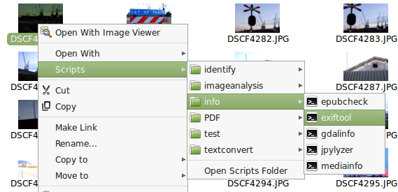
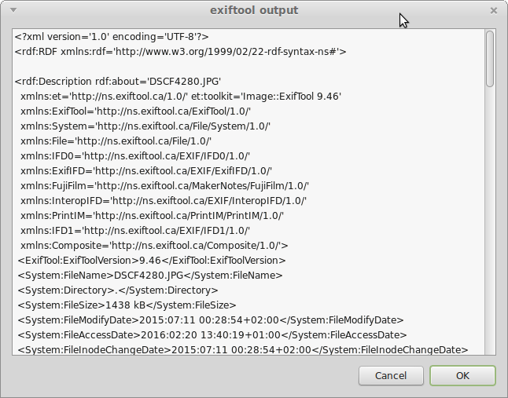

## Contents of this repo

This repo contains a collection of small utility scripts that define context menu actions that can be used in both the [Unity](https://unity.ubuntu.com/) and [MATE](http://mate-desktop.com/) desktop environments. On Unity they work with the Nautilus file manager, whereas on MATE they will work with Caja. Scripts are organised into the following categories:

* **identify**: format identification / magic detection using Unix File and Apache Tika.

* **info**: display technical information about a file. Currently included:
    * ExifTool - display metadata on lots of (mostly graphics) formats
    * MediaInfo - display metadata on lots of video and audio formats
    * Jpylyzer - validate JPEG 2000 Part 1 + display metadata
    * Epubcheck - validate Epub + display metadata
    * gdalinfo - display metadata on varous geospatial formats

* **PDF**: various PDF analysis operations:
    * pdfinfo - display metadata
    * pdftk - display general metadata, annotations
    * qpdf - check on file structure + encryption, linearization

* **imageanalysis**: various basic image analysis scripts, all using ImageMagick
    * psnr - compare 2 images and report difference as PSNR value

* **textconvert**: several conversions from / to Markdown, all using Pandoc.

## Installation

First install [Zenity](https://wiki.gnome.org/action/show/Projects/Zenity) (if you don't have it already):

    sudo apt-get install zenity
 
If you're using the **Caja** file manager (MATE desktop), copy the scripts in this repo to `~/.config/caja/scripts/` or one of its subdirectories. If you're a **Nautilus** user, copy the scripts to `~/.local/share/nautilus/scripts/`.

The tools that are called by the scripts must be installed separately.

## Using the scripts

In Caja (or Nautilus) right-click on a file. Then select the *Scripts* item in the context menu, and navigate to the one you want to use. For example, to run ExifTool on an image file do this:

The results are displayed in a text box:

## Adding new scripts

The easiest way is to copy one of the existing scripts and modify it to your needs. Note that scripts must be executable to work. You can do this with `chmod`, e.g.:

    chmod a+x newscript.sh

## More information

* [Adding Right Click context actions to Caja](http://www.ethanjoachimeldridge.info/tech-blog/caja-exifstrip-context-action)

* [Add Right-Click Commands in Linux Mint / Ubuntu](http://www.pcsteps.com/4434-add-right-click-commands-linux-mint-ubuntu/)
 